# AlTayerSemih

This app is developed for AlTayer Android code challenge.

- MVP architecture is used in this project.
- It is written in Kotlin. (Some advanced Kotlin features are used such as DSLs. [*](https://github.com/sembozdemir/AlTayerSemih/blob/master/app/src/main/java/com/sembozdemir/altayersemih/extensions/Picassos.kt))
- Dagger2 is used for dependency injection. Helper classes are injected into views or presenters.
- Retrofit is used for networking.
- Picasso is used for image downloading and caching library.
- [@Parcelize annotation](https://github.com/Kotlin/KEEP/blob/master/proposals/extensions/android-parcelable.md) is used for Parcelable data classes. [*](https://github.com/sembozdemir/AlTayerSemih/blob/master/app/src/main/java/com/sembozdemir/altayersemih/network/model/Product.kt#L7)
- Shared element transitions are used between activities.
- Timber is used for logging and reporting exceptions easily.

This app includes three screens: List, Detail, Fullscreen Photo

## 1. List screen
Products are listed in this screen. Data comes from network. It may be refreshed 
by swiping down. It supports pagination. A list item includes an image, title, brand name and price. 

Product colors are used as placeholder for images. 
(Color information is read from `facets/color` path and stored in [ColorMapper](https://github.com/sembozdemir/AlTayerSemih/blob/master/app/src/main/java/com/sembozdemir/altayersemih/util/ColorMapperImpl.kt)
in order to use it later if needed.)

*Screenshots:*

,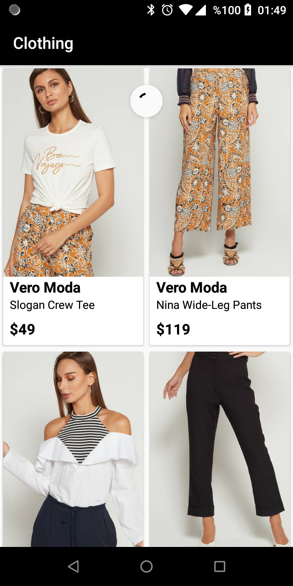

## 2. Detail screen
Detail screen will be navigated when a list item is clicked. `sku` is passed to the detail screen and used for a network call. 
CollapsingToolbarLayout is used on this screen. More information of the product is shown such as
color and size options, description, size and fit. All images may be seen in ViewPager. 
Clicking on image will show full screen mode.

'Add to bag' bottom sheet will appear by clicking on color or size options and 'Add to bag' button as well.

*Screenshots:*

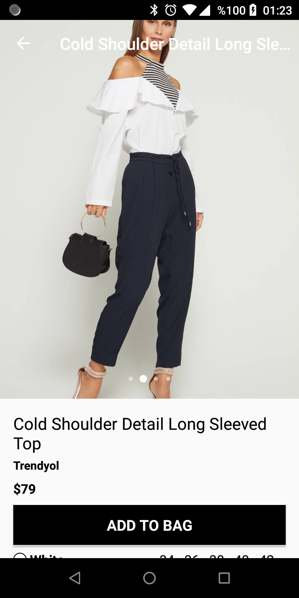,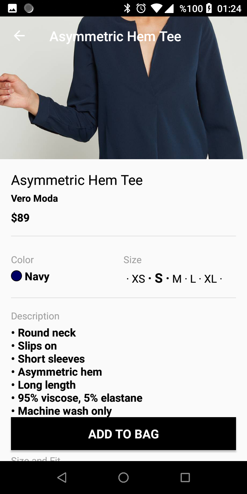

### 2.1 'Add to bag' bottom sheet
Color and size may be selected here. `configurableAttributes` objects are used for populating this layout. 
Every `configurableAttributes` object is represented as a vertical list item which includes a horizontal list 
to show `options` items horizontally. So, if there is a color option, it will be listed on this screen. 

If user selects a new color, product will be requested again with a new `sku`. Size option will be deselected 
and 'Add to bag' button will be disabled.

If user selects a new size, product will be requested again with a new `sku`. 'Add to bag' button will be disabled if user is not selected any size.

If user clicks on 'Add to bag' button, a dummy toast message will appear. There is no real cart implementation.[*](https://github.com/sembozdemir/AlTayerSemih/blob/master/app/src/main/java/com/sembozdemir/altayersemih/ui/detail/addtobag/AddToBagDialogFragment.kt#L68)

*Screenshots:*

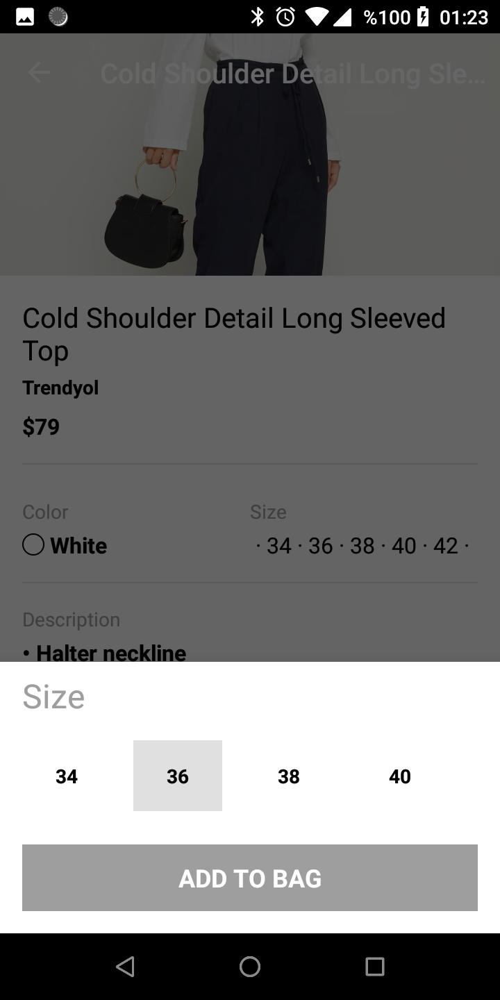,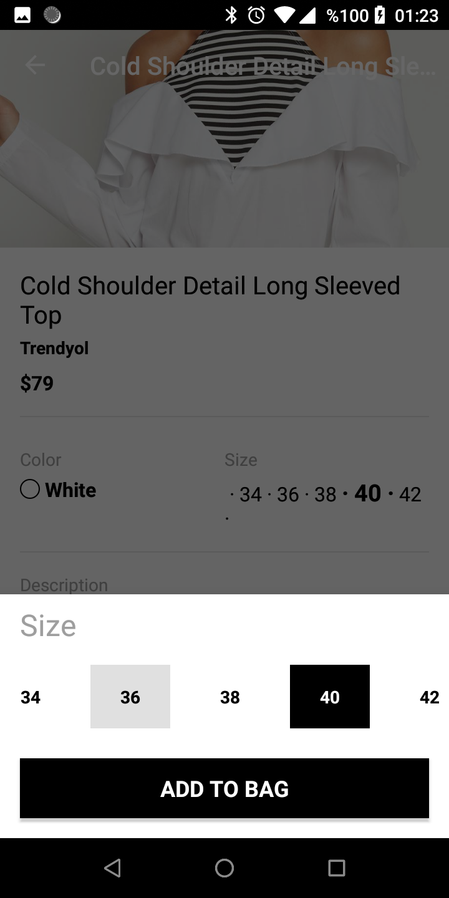

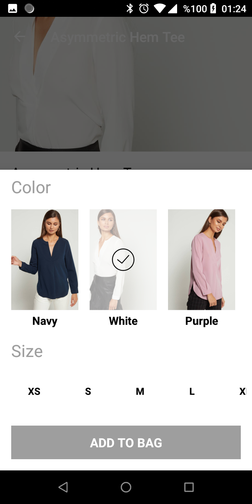,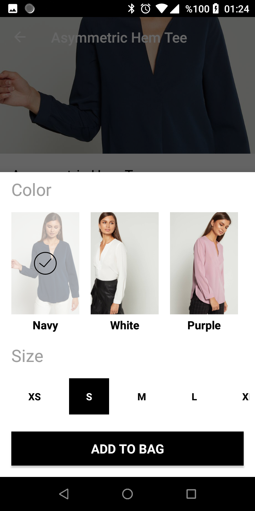

**How to implement a new option?**

To implement a new option, [ConfigOptionViewHolder](https://github.com/sembozdemir/AlTayerSemih/blob/master/app/src/main/java/com/sembozdemir/altayersemih/ui/detail/addtobag/ConfigOptionViewHolder.kt)
should be extended. `configurableAttribute[]/code` should be added to [ProductConfigItem](https://github.com/sembozdemir/AlTayerSemih/blob/master/app/src/main/java/com/sembozdemir/altayersemih/ui/detail/addtobag/ProductConfigItem.kt#L17).
Also, some little changes are needed on other classes.[*](https://github.com/sembozdemir/AlTayerSemih/blob/master/app/src/main/java/com/sembozdemir/altayersemih/ui/detail/addtobag/ProductConfigItemViewHolder.kt#L29)
[*](https://github.com/sembozdemir/AlTayerSemih/blob/master/app/src/main/java/com/sembozdemir/altayersemih/ui/detail/addtobag/ConfigOptionsRecyclerAdapter.kt#L27)

## 3. Fullscreen Photo Screen
Images of products may be seen in fullscreen mode. It also supports
zooming feature.

*Screenshots:*

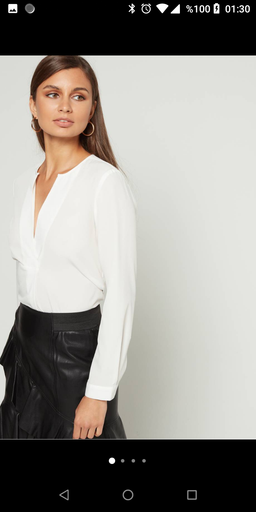,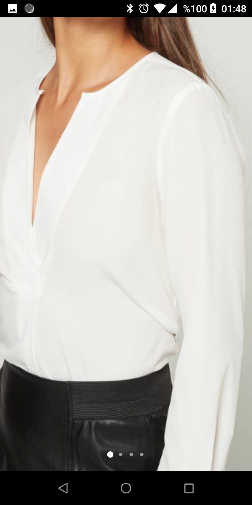

## Multi-brand flavors
Product flavors may be used for multi-branding. Multiple apks may be generated with this project.

Base api url is configurable as a `buildConfigField` by flavor.[*](https://github.com/sembozdemir/AlTayerSemih/blob/master/app/build.gradle#L45)

`applicationIdSuffix` may also be added by flavor.[*](https://github.com/sembozdemir/AlTayerSemih/blob/master/app/build.gradle#L44)

Colors may be changed by overriding resource files.[*](https://github.com/sembozdemir/AlTayerSemih/blob/master/app/src/prodNisnass/res/values/colors.xml#L3)
For example, if `prodNisnassDebug` build variant is selected, application will be seen in green color.

Even layouts may be changed in this way.

*Screenshots:*

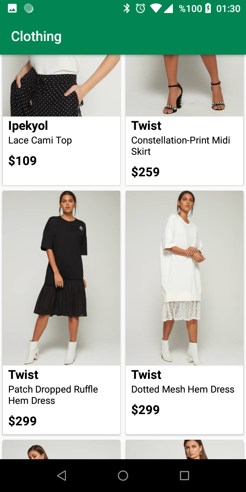,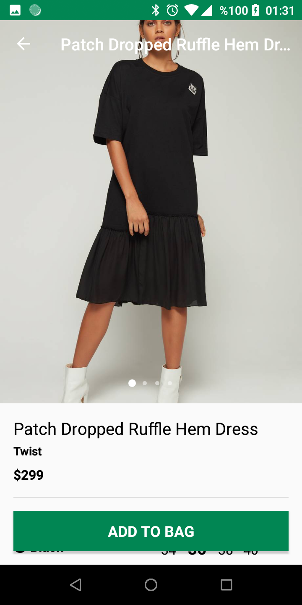

## Used 3rd party libraries
- Mosby MVP
- Dagger2
- RxJava
- Retrofit
- Picasso
- PhotoView
- CircleIndicator
- CircleImageView
- Timber
